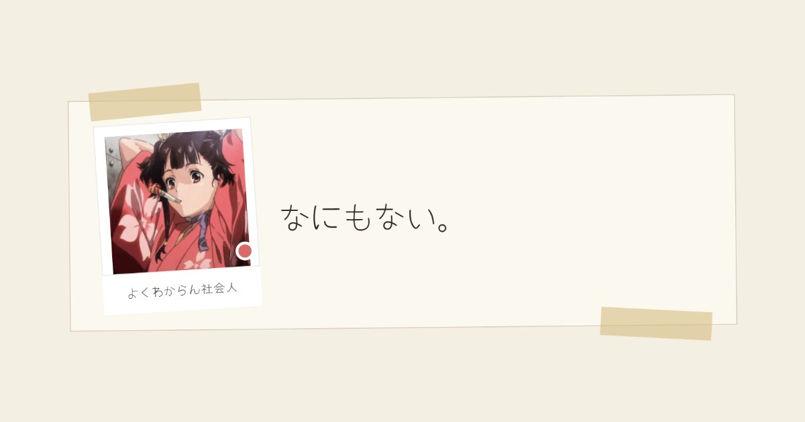

# Pooのくそさいと

https://poo123.com/

※AI(Claude)がすべて作ってます。人間がコードに全然関与していません！！！！！！😍

うんちさんが むだに買ったドメインで 遊んでいる個人サイト。
紙とマスキングテープの見た目をしていて、中身は とくにない。



---

## なにが のっているか

| ところ | なかみ |
| --- | --- |
| じぶん | 写真と チェックリスト |
| いま | Discord のようす。オンライン状態・やっていること・聴いているものが **そのまま動く** |
| きょうの ひとこと | 日替わりの一行 |
| さわったことあるやつ | さわった言語のシール |
| すきな ごはん | レシート |
| しよう | PC のスペック板 |
| よくある しつもん | 開いて閉じるやつ |
| りんく | 各サービスへ。カードに触ると 外部のミニプロフィールが出る |

ページが見つからないときは `404.html`（下が破れた紙）が出る。

---

## ファイルの ならび

```
.
├── index.html       ページ本体 ＋ Discord 埋め込みの定義
├── style.css        見た目ぜんぶ（紙・テープ・風・アニメーション）
├── script.js        Discord 連携・日替わり文・スクロール演出・飛んでくるもの
├── 404.html         ページが ないときの紙
├── photo/           画像（アイコン / 埋め込み用 / OGP / favicon）
├── wrangler.jsonc   Cloudflare Workers の設定
├── .assetsignore    配信しないファイルの一覧
└── README.md        これ
```

ビルドは いらない。素の HTML・CSS・JavaScript だけで、依存パッケージもない。

---

## Discord のようす（いま）

[Lanyard](https://github.com/Phineas/lanyard) の WebSocket（`wss://api.lanyard.rest/socket`）に
つないで、届いたものを そのまま紙の上に出している。キーは いらない。

出しているもの:

- オンライン状態（オンライン / はなれてる / とりこみ中 / いない）
- アバターと **アバターデコレーション**
- **ネームプレート** — 動く版（`asset.webm`）を再生。
  透けている部分があるので、流れはじめたら 下の静止画は どける。
  読めなかったときだけ 静止画（`static.png`）に もどる
- **サーバータグ** — 名前の右に Discord とおなじ並びで
- やっていること（ゲーム / 動画 / 音楽 / 配信 / 参戦）
  - **2件まで**出して、あまったぶんは「ほかに ◯ こ」でたたむ
  - 終わりの時刻がわかるもの（音楽・動画）は **再生バーと 再生位置**を出す
  - 活動の画像は 直リンクだと断られることがあるので
    `media.discordapp.net` 経由で もらっている

> Lanyard を使うには、Lanyard の Discord サーバーに 入っている必要がある。

「動きを減らす」設定（`prefers-reduced-motion`）のときは、
動くネームプレートも 飛んでくるものも 止まる。

---

## Discord に貼ったときの埋め込み

`index.html` の中の

```html
<script id="discord:component-embed" type="application/json">
```

が それ。Discord の Components v2 で、見出し・説明・アイコン・画像・ボタンを並べている。

きまりごと:

- 部品は **40個**まで、全体で **3,000バイト**まで
- ボタンは 1行に **5個**まで
- 画像は PNG / GIF / JPEG / WebP / AVIF

X や LINE に貼ったときは、`og:image` に指定した `photo/ogp.jpg`（1200×630）が出る。

---

## りんくの ミニプロフィール

りんくのカードに 触れると、そのサービスの プロフィールが 小さい紙で出てくる。

| サービス | どこから |
| --- | --- |
| Discord | Lanyard（「いま」と おなじ接続を 使いまわす） |
| X | `api.fxtwitter.com` |
| GitHub | `api.github.com` |
| Instagram / Spotify / Steam | 公開 API が ないので ひとことだけ |

どれも キーなし・CORS 許可ずみ。取れなかったときは 黙って ひとことだけに なる。

---

## うごかしかた

静的ファイルだけなので、置いて開けば うごく。

```sh
npx serve .
```

Cloudflare へは `main` に push すると 自動で出る（Workers Builds）。
手でやるなら:

```sh
npx wrangler deploy
```

`.assetsignore` に書いたもの（`.git` / `README.md` / `wrangler.jsonc` など）は
配信されないので、ブラウザから 中は見られない。

---

## つかっているもの

- [Cloudflare Workers](https://developers.cloudflare.com/workers/static-assets/) — 静的アセットの配信
- [Lanyard](https://github.com/Phineas/lanyard) — Discord のようす
- [Google Fonts](https://fonts.google.com/) — Yomogi / Zen Kurenaido / Caveat
- [Font Awesome](https://fontawesome.com/) — アイコン
- [fxtwitter](https://github.com/FixTweet/FxTwitter) — X のプロフィール

---

## ことわり

コードは 好きに見てもらって かまわないけれど、
写真・アイコン・本文は 本人のものなので、そのまま使うのは やめてほしい。
